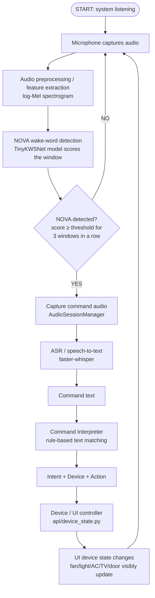

# SIH Voice Activator — Complete Guide

**Project:** NOVA — Low-Latency Voice Activator for Edge Devices (SIH 2026, PS-26172)
**Audience:** anyone with zero prior background in this project, wake-word detection, speech recognition, or audio processing.
**Basis:** every claim, filename, class, and parameter in this document was verified directly against the current code in this repository — nothing is invented.

---

## 1. Project Overview

**SIH Voice Activator (project name: NOVA)** is a voice-controlled smart-room assistant. A person says a **wake word** ("NOVA") followed by a command ("turn on the fan"), and the system listens, understands the command, and changes the state of a virtual device — visible immediately in a on-screen smart-room interface.

**The problem it solves:** many voice assistants either run entirely in the cloud (privacy/latency cost) or require expensive hardware. This project demonstrates a **low-latency, mostly-local** pipeline suitable for a resource-constrained ("edge") device: a tiny, purpose-built neural network listens for the wake word locally, and only a short recognized command needs to leave the wake-detection stage for speech-to-text.

**What happens when a user interacts with it, in plain terms:**
1. The system is always quietly listening through the microphone.
2. The user says "NOVA." The system recognizes its name.
3. The user then says a short command, e.g. "turn on the fan."
4. The system turns that spoken command into text, figures out what device and action were meant, and updates that device's state.
5. The on-screen room UI shows the change immediately (e.g., the fan's blades start spinning).

---

## 2. Complete System Workflow

```
User speaks "NOVA, turn on the fan"
        │
        ▼
Microphone captures continuous audio (audio_processing/capture.py)
        │
        ▼
Audio is split into small analysis windows and turned into a
"log-Mel spectrogram" — a picture-like numeric representation of
sound (keyword_spotting/features.py)
        │
        ▼
A small neural network scores each window: "how NOVA-like is this?"
(keyword_spotting/detector.py, model: TinyKWSNet)
        │
        ▼
Score crosses a threshold for several windows in a row → wake word
CONFIRMED (not just a lucky single frame)
        │
        ▼
The system starts recording the command that follows
(audio_processing/session.py — AudioSessionManager)
        │
        ▼
Recording stops automatically once the user stops talking
        │
        ▼
That recorded audio is converted to text (asr/transcriber.py,
faster-whisper)
        │
        ▼
The text is matched against a small set of known command patterns
(command/interpreter.py) → device + action extracted
        │
        ▼
The device's state is updated (api/device_state.py)
        │
        ▼
The change is pushed to the browser UI, which visibly updates the
matching device (frontend/code.html)
        │
        ▼
System returns to listening for the next "NOVA"
```

Every stage above is a **separate, independently-testable module** — this matters for a beginner to understand: nothing here is one giant program. Each box is its own Python file/class with its own unit tests.

---

## 3. Flowchart



This is the exact structure implemented by `voice_pipeline/orchestrator.py`, which wires every stage together without re-implementing any of it.

---

## 4. Major Project Components

| Component | What it does | Input → Output |
|---|---|---|
| `audio_processing/` | Captures live microphone audio (`capture.py`, using the `sounddevice` library), buffers it, detects silence (`vad.py` — Voice Activity Detector), and manages the wake→record→stop lifecycle (`session.py` — `AudioSessionManager`). | Raw mic samples → one finished "command audio segment" |
| `keyword_spotting/` | Everything about recognizing the word "NOVA": feature extraction (`features.py`), the neural network itself (`model.py` — `TinyKWSNet`), the live detector (`detector.py` — `KeywordDetector`), and a checkpoint-loading wrapper (`tinykws_backend.py`). | Audio window → NOVA probability (0–1) |
| `keyword_spotting/training/` | Scripts to build the KWS model: load recordings (`dataset.py`), split them fairly into train/validation/test (`splitting.py`), run training (`train.py`), and compute accuracy metrics (`metrics.py`). | Recorded `.wav` files → a trained checkpoint file |
| `asr/` | Converts recorded speech into text using `faster-whisper` (`transcriber.py`). | Command audio → text transcript |
| `command/` | Turns a text transcript into a structured action using pattern matching (`interpreter.py` — `CommandInterpreter`). | Text → {intent, device, action} |
| `voice_pipeline/` | The **orchestrator** (`orchestrator.py` — `VoiceCommandOrchestrator`) that calls every stage above in the right order and measures timing at each step. | Mic audio stream → final structured result |
| `api/` | The FastAPI web server: serves the UI, runs the live microphone pipeline in the background (`live_session.py`), holds the current on/off state of every device (`device_state.py`), and pushes updates to the browser over a WebSocket (`routers/live.py`). | Recognized command → live UI update |
| `frontend/` | The browser-based smart-room UI (`code.html`) — a photorealistic room image with independently animated device layers (lamp glow, spinning fan, AC mist, door swing, TV screen). | Device state → visible room change |
| `scripts/` | Standalone command-line tools for testing each stage in isolation (mic-only test, KWS-only test, full pipeline test, training-data validation, etc.) without needing the web UI. | — |
| `tests/` | Automated unit and integration tests for every module above (370 tests at the time of writing). | — |
| `voice_separation/` (Conv-TasNet) | **Not part of the NOVA wake-word workflow.** This is a separate, earlier-milestone module for splitting overlapping speakers' voices apart, loaded by the API for its own demo endpoints. It is not called anywhere in the wake→command pipeline. Included here only because it exists in the repository. | (separate feature) |

---

## 5. Wake-Word Detection

**What a "wake word" is:** a specific word (here, "NOVA") that a device listens for constantly, so it only "wakes up" and starts really paying attention when it's actually being addressed — the same idea as "Hey Siri" or "Alexa."

**What the KWS (Keyword Spotting) model does:** it does *not* understand language. It only answers one narrow question, repeatedly, many times per second: *"does the last one second of audio sound like the word NOVA?"* — and returns a probability between 0 and 1.

**What TinyKWSNet is:** a small custom convolutional neural network (`keyword_spotting/model.py`), deliberately kept tiny (6,018 trainable parameters, ~31 KB as a saved file) so it could eventually run on constrained edge hardware — not a large general-purpose speech model.

**How audio becomes "features":** raw audio is just a long list of numbers (samples). Before it's shown to the model, it's converted into a **log-Mel spectrogram** — a 2D grid showing how much energy is present at different pitches over time, similar to how a piano-roll shows notes over time. This conversion (`keyword_spotting/features.py`) uses **40 Mel frequency bands** over a **1.0-second** window.

**How the model produces a score:** the spectrogram is fed through the small CNN, which outputs two numbers (via "softmax," a way of turning raw scores into probabilities that add up to 1): probability of "NOVA" and probability of "not NOVA." The NOVA probability is the score used everywhere else.

**What the threshold means:** the score alone isn't enough — the system needs a cutoff to decide "yes, that's NOVA" vs. "no." That cutoff is the **threshold**. `keyword_spotting/detector.py` also requires the score to stay above threshold for **3 consecutive analysis windows** (`DEFAULT_CONSECUTIVE_FRAMES = 3`) before declaring a real detection — this "debounce" prevents one lucky noisy frame from triggering a false wake.

**Production default vs. demo threshold:** the code's shipped default is `DEFAULT_THRESHOLD = 0.85`. Measured against this project's own 10 verified NOVA recordings, real NOVA utterances score in the 0.25–0.63 range — **never reaching 0.85**. Running at the 0.85 default, the trained model essentially never fires. For live demonstration only, the system supports an explicit, opt-in override: `--kws-threshold 0.40` on `scripts/voice_command_demo.py`, or the `NOVA_KWS_THRESHOLD` environment variable read by `api/live_session.py` when starting the web server. **0.40 is a demo-only configuration, chosen because it was the most balanced point found by directly measuring this project's own 20 verified recordings (10 NOVA + 10 non-NOVA) — it is not a claimed production accuracy figure**, and the code's actual default (0.85) is never modified.

---

## 6. Dataset and Training

**Positive samples** are recordings of someone actually saying "NOVA" — these teach the model what the target word sounds like. **Negative samples** are recordings of other speech (e.g., "hello," "computer") — these teach the model what NOVA does *not* sound like. Both are required: a model trained only on positive examples has no way to learn what to reject.

**Current dataset:** exactly **10 positive** and **10 negative** real recordings (`data/kws/real/positive/`, `data/kws/real/negative/`), each individually reviewed and confirmed (see the recordings' own `metadata.json` files, which log which clips were manually rejected during collection). All 20 clips are **1.0 second**, **16,000 Hz (16 kHz)**, mono `.wav` files.

**Training command actually used** (`keyword_spotting/training/train.py`):
```
python -m keyword_spotting.training.train --data-dir data/kws/real --out models/kws_nova_cnn.pt --epochs 30
```

**Validation/test split:** the training script splits the 20 clips into **train/validation/test** groups (`keyword_spotting/training/splitting.py`), keeping any augmented variants of the same recording together so the same utterance never leaks across splits. With `val_fraction=0.15` and `test_fraction=0.15` (the script's own defaults) applied to only 20 examples, this produced **12 training / 4 validation / 4 test** examples.

**Model output:** the trained checkpoint is saved to `models/kws_nova_cnn.pt`, containing the model's learned weights plus its own feature configuration (n_mels, sample_rate, window_seconds) and the metrics measured at save time: **best validation accuracy 0.75**, **test accuracy 1.0** (on only 4 test examples).

**Be honest about the limitation:** 20 total recordings from what appears to be one or two speakers is a *very* small dataset. The reported "1.0 test accuracy" is measured on just 4 examples and uses a much looser 50% decision boundary than the real system's 0.85 threshold — it is **not** evidence that the model works reliably in general. Directly measuring the deployed checkpoint against all 20 real clips (not just the 4-example test split) showed the top-scoring non-NOVA recording (0.62) sits almost exactly next to the top-scoring NOVA recording (0.63) — meaning no single threshold cleanly separates the two classes on this data. **More recordings, from more speakers and conditions, would be needed for reliable, general-purpose detection.**

---

## 7. Audio Parameters

| Parameter | What it means | Why it matters | Current value |
|---|---|---|---|
| Sample rate | How many audio samples are captured per second | Must match what the KWS model and ASR were trained/expect | 16,000 Hz (16 kHz) everywhere |
| Channels | Number of microphone channels captured | The model only understands mono (single-channel) audio | 1 (mono) |
| Sample format | How each audio sample is stored in memory | Determines precision/range of the audio | 32-bit float, range −1 to 1 |
| Mic chunk size | How many samples `MicCapture` delivers per callback | Smaller = lower latency, more Python overhead | 512 samples (~32 ms) |
| KWS analysis window | How much audio the wake-word model looks at per decision | Needs to be long enough to contain the whole word "NOVA" | 1.0 second |
| KWS hop | How often a new analysis window is evaluated | Smaller = faster reaction, more CPU use | 0.2 seconds (5×/sec max) |
| Mel bands (n_mels) | Number of frequency bands in the spectrogram "picture" | More bands = more detail, bigger model | 40 |
| Feature window/hop (ms) | Size/stride of the FFT windows used inside spectrogram computation | Standard speech-processing values | 25 ms window / 10 ms hop |
| Pre-roll | How much audio *before* the wake word is kept and handed to command capture | Wake detection has some reaction delay; without this, the first fraction of a second after "NOVA" would be lost | 1.0 second |
| Minimum command duration | Shortest time command capture will run before silence can end it | Prevents a natural pause right after "NOVA" from ending the recording before the user has said anything | 1.2 seconds |
| Silence timeout | How much continuous silence ends command capture | Detects "the user has finished speaking" | 0.8 seconds |
| Maximum command duration | Hard cap on how long one command recording can run | Safety limit if silence is never detected | 8.0 seconds |
| KWS threshold (production default) | Minimum NOVA probability to count as a detection | The accuracy/false-trigger trade-off point | 0.85 (`keyword_spotting/detector.py`) |
| KWS threshold (explicit demo override) | Session-only override for live demonstration | Chosen from measured data on this project's own recordings, not the shipped default | 0.40 (`--kws-threshold` / `NOVA_KWS_THRESHOLD`) |
| Consecutive frames | Number of windows in a row that must clear the threshold | Prevents one noisy frame from triggering a false wake | 3 |

---

## 8. ASR / Speech Recognition

**ASR (Automatic Speech Recognition)** is the technology that converts recorded spoken audio into written text.

**Implementation used:** `faster-whisper`, a fast local implementation of OpenAI's Whisper model, running the smallest available model size, **`tiny.en`**, entirely on the CPU (`asr/transcriber.py`). This model is generic/pretrained — it has **not** been fine-tuned on NOVA or on this project's own recordings.

**How captured audio reaches ASR:** once `AudioSessionManager` finishes recording a command (silence detected or max duration reached), the resulting audio segment is handed directly to `Transcriber.transcribe()` — no intermediate file, no network call.

**What happens on an incorrect/empty transcript:** ASR never invents a result. If the captured audio contains no real speech, `transcribe()` returns an empty or garbled string; that text then simply fails to match any pattern in the Command Interpreter, so it is reported as `action="unknown"` — not treated as an error, and not silently ignored either (it's still logged and shown in the UI as "Command not recognized").

**Key configuration:** model `tiny.en`, device `cpu`, compute type `int8` (a faster, lower-precision numeric format used for CPU inference) — all in `asr/transcriber.py`'s defaults.

---

## 9. Command Interpretation

The **Command Interpreter** (`command/interpreter.py`) is a small, fully local, rule-based text matcher — not a machine-learning model. It uses a fixed, ordered list of regular-expression patterns to turn plain text into a structured result with four key fields: `intent` (a broad category), `device`, `action`, and `confidence` (always exactly 1.0 for a matched rule, or 0.0 for no match — this is deliberately not a graded/statistical score, since it's a deterministic pattern match, not a learned model).

**Example — the transcript "turn on the fan":**
```
Intent:  device_control
Device:  fan
Action:  turn_on
```

**Other commands the current implementation actually supports** (from `command/interpreter.py`'s pattern list):
- "open the door" → `intent: device_control, device: door, action: open`
- "turn off the light" → `intent: device_control, device: light, action: turn_off`
- "turn on the TV" → `intent: device_control, device: tv, action: turn_on`

(The interpreter also recognizes volume, music, "help," and "stop"/"cancel" patterns, though the room UI currently only visualizes the five room devices below.)

If a command names a recognized verb ("turn on") but no valid device follows it, the interpreter returns a distinct result (`missing_parameters: ["device"]`) rather than lumping it in with a totally unrecognized sentence — so the system could, in principle, respond "turn on *what*?"

---

## 10. UI and Device Control

The interface is a full-screen, photorealistic bedroom/office scene ("the retro 90s room UI") with a dark header (NOVA logo, live clock, microphone/listening indicator) and a bottom info strip (last interaction, NOVA's response, system latency). Floating translucent cards sit directly over each physical device in the room: **Fan, AC, Door, Light, TV.**

**How device states are represented:** a single JavaScript object, `DeviceState` (in `frontend/code.html`), holds the on/off (or locked/open) state of all five devices. Each device also has its own visual reaction — the fan's blade layer rotates, the lamp gets a warm glow overlay, the AC shows animated mist, the TV screen mask fades to reveal a lit picture, and the door swings open in 3D — driven by the same shared state object, never a separate copy.

**How voice commands update the UI:** a recognized command travels `api/live_session.py` → `api/device_state.py` (`execute_device()`) → a WebSocket `device_update` event → the browser's `handleLiveEvent()` → the same `toggleDevice()` function.

**How manual and voice control interact:** the on-screen settings-panel demo buttons call that *exact same* `toggleDevice()` function. Because both paths converge on one shared state object, a manual click and a real voice command are indistinguishable to the rest of the UI — they always stay synchronized.

**Example:** saying "NOVA, turn on the fan" makes the `Fan` card switch to "ON" and the fan's blades visibly begin rotating in the room image — not just a text label change.

*(This document only describes the existing UI; no UI changes were made while writing it.)*

---

## 11. Tools and Technologies

| Tool / Library | Purpose in this project | Where it's used |
|---|---|---|
| **PyTorch** (`torch`) | Defines and runs the TinyKWSNet neural network | `keyword_spotting/model.py`, `tinykws_backend.py` |
| **torchaudio** | Audio utilities alongside PyTorch | `voice_separation/` (Conv-TasNet module) |
| **librosa** | Computes log-Mel spectrograms (feature extraction) | `keyword_spotting/features.py` |
| **soundfile** | Reads/writes `.wav` files | `audio_processing/utils.py`, training dataset loading |
| **sounddevice** | Opens the live microphone stream (via PortAudio) | `audio_processing/capture.py` |
| **faster-whisper** | Speech-to-text (ASR) | `asr/transcriber.py` |
| **FastAPI** | Web server framework serving the UI and REST/WebSocket APIs | `api/main.py` and all of `api/routers/` |
| **uvicorn** | ASGI server that actually runs the FastAPI app | launched via `uvicorn api.main:app` |
| **NumPy** | Numeric array operations on raw audio everywhere | throughout |
| **scikit-learn** | General ML utilities used in training/evaluation tooling | `keyword_spotting/training/` |
| **pydantic** | Data-validation schemas for the API | `api/schemas.py` |
| **pytest** | Automated test runner | `tests/` (370 tests) |
| **HTML/CSS/JavaScript + inline SVG** | The browser-based smart-room UI, including the animated table fan | `frontend/code.html` |

---

## 12. Complete Example: "NOVA, turn on the fan"

1. **Microphone:** `MicCapture` continuously delivers 512-sample audio chunks from the real microphone.
2. **Feature extraction + KWS scoring:** each chunk feeds a sliding 1.0-second window; every 0.2 seconds, `keyword_spotting/features.py` turns that window into a 40-band log-Mel spectrogram, and `TinyKWSNet` scores it for "NOVA-ness."
3. **Wake confirmed:** once the score stays ≥ the active threshold (0.40 in the current demo configuration) for 3 consecutive windows, `KeywordDetector` returns `status="DETECTED"`.
4. **Command capture begins:** `AudioSessionManager` switches to `COMMAND_CAPTURE`, seeding the recording with 1.0 second of pre-roll audio (so the very start of "turn on the fan" isn't lost), then keeps recording new audio until it detects ≥0.8 seconds of silence (after at least 1.2 seconds have been captured).
5. **Speech-to-text:** the finished audio segment is handed to `faster-whisper` (`asr/transcriber.py`), producing the text `"turn on the fan"`.
6. **Command interpretation:** `CommandInterpreter.interpret()` matches this against its `turn_on` pattern, returning `intent="device_control"`, `device="fan"`, `action="turn_on"`, `confidence=1.0`.
7. **Device state update:** `api/device_state.py`'s `execute_device("fan", "turn_on")` sets the fan's stored state to `"ON"`.
8. **UI update:** this change is broadcast as a `device_update` WebSocket event; the browser calls `toggleDevice("fan", true)`, and the Fan HUD card switches to "ON" while the table fan's blade layer starts its rotation animation in the room image.
9. **Back to listening:** the session resets and the system returns to listening for the next "NOVA."

---

## 13. Current Status and Limitations

**Currently working, verified live:**
- Full pipeline runs end-to-end on a real microphone: wake detection → command capture → ASR → command interpretation → live UI update, confirmed for multiple devices (fan, light, TV, door).
- 370 automated tests pass.
- Manual and voice control share identical state and stay synchronized.

**Explicitly demo-grade, not production claims:**
- The KWS threshold is running at an explicit **0.40 override for demonstration purposes only**; the code's shipped default remains 0.85, at which the current model essentially never fires on real speech.
- At 0.40, the system also produces **false wake detections** on ambient room noise fairly often (measuring the deployed checkpoint against all 10 verified negative recordings, 9 of 10 score below 0.40 — about 90% specificity — and continuous listening multiplies that remaining false-trigger chance many times per minute).
- The KWS model was trained on only 20 total recordings — far too few for a general accuracy claim.

**Not validated on final SIH hardware:** every latency and resource number measured in this project (KWS inference time, ASR latency, memory footprint) was measured **on a development laptop's CPU**, not on any target edge device. No claim is made about performance on constrained/embedded hardware.

**Known dataset/model limitations:**
- All recordings likely come from a small number of speakers, in one acoustic environment.
- The top-scoring non-NOVA recording and the top-scoring NOVA recording are almost tied in confidence — meaning no single threshold perfectly separates the two classes on the current data.
- `command/interpreter.py`'s pattern set is a small illustrative example vocabulary, not a finalized/validated NOVA command list.

---

## 14. Quick Summary (read this before a presentation)

**NOVA is a voice-controlled smart-room demo.** A small, purpose-built neural network (TinyKWSNet, ~6,000 parameters, ~31 KB) listens continuously to the microphone for the word "NOVA," scoring one-second windows of audio roughly 5 times per second. Once it's confident enough for three windows in a row, the system records whatever is said next, converts it to text using a local Whisper speech-to-text model, matches that text against a small set of known command patterns (turn on/off, open/close, for devices like the fan, light, TV, AC, and door), and immediately updates that device's state — visible live in a photorealistic smart-room web UI where the physical device (spinning fan blades, glowing lamp, swinging door) reacts, not just a text label. The KWS model was trained on only 20 manually verified recordings, and the production confidence threshold (0.85) is currently too strict for this small dataset to ever cross — so today's demo runs on an explicit, clearly-labeled 0.40 override, not the shipped default. Everything downstream of wake detection (audio capture, speech-to-text, command parsing, device state, and the UI) is fully working and tested; the wake-word model itself is the one honestly-labeled demo-grade component, and more diverse training data is the clear next step toward a production-ready system.
